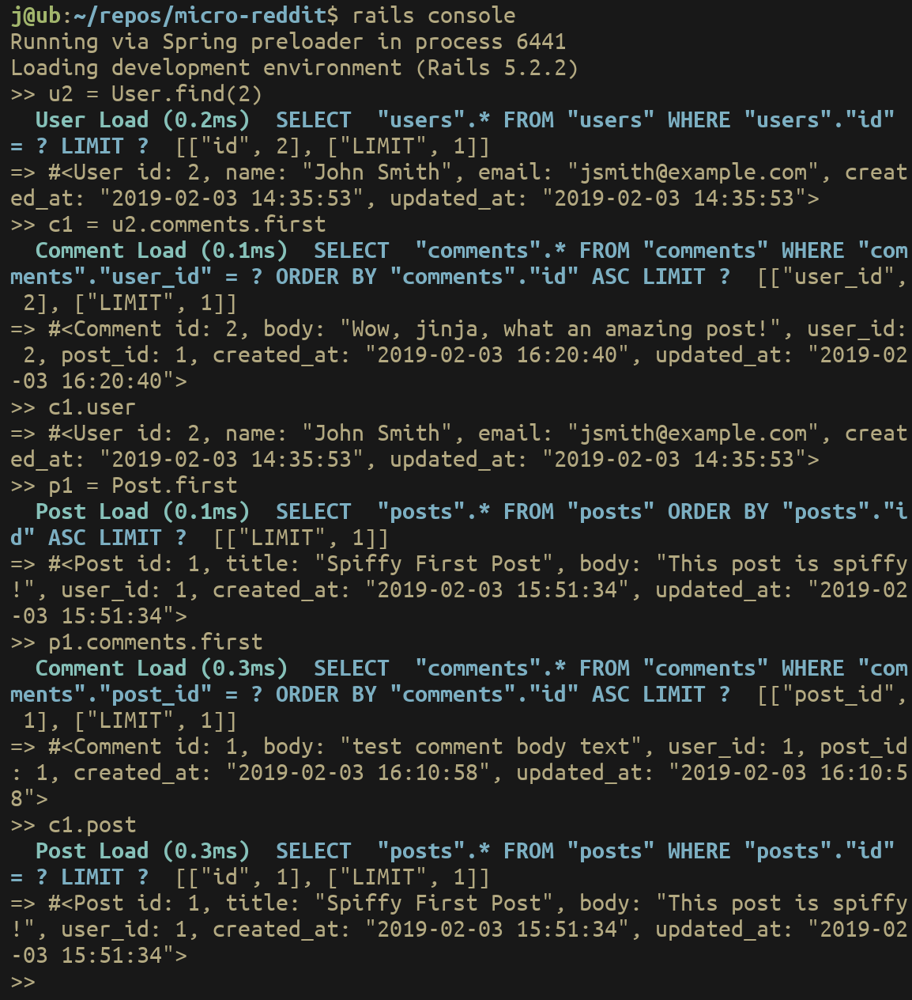
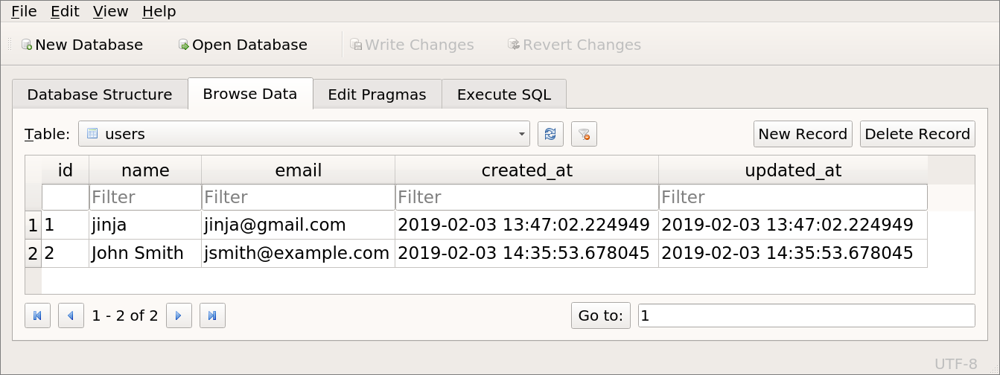
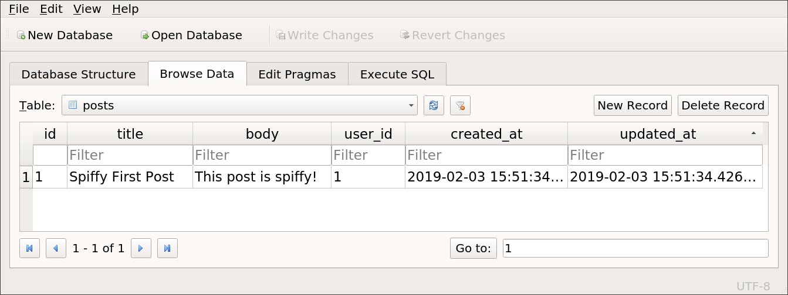
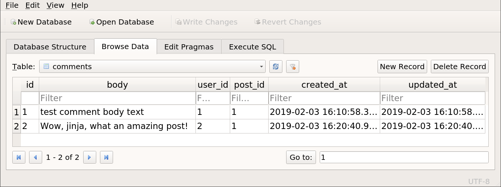
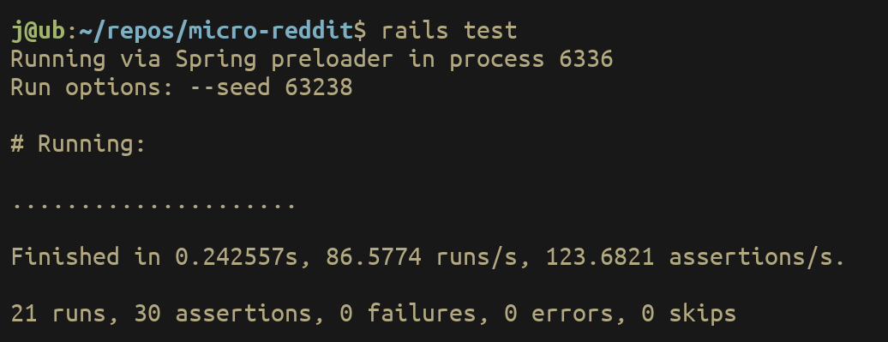

Simon Tharby's solution to [Project 2: Micro-Reddit](https://www.theodinproject.com/courses/ruby-on-rails/lessons/building-with-active-record-ruby-on-rails?ref=lnav), The Odin Project, Ruby on Rails unit, Active Record Basics section.

Instructions (summary): To build and test (validate) models for a micro-reddit style app, including User, Post and Comment models and the appropriate associations between them.

Note: I chose to also create tests for the models (see below).

Terminal output when following last section of instructions:



## Generating Models:

N.B. Use <code><model>:references</code> in <code>rails generate model...</code> to create correct foreign key id references. For example; <code>rails generate model Comment body:text user:references post:references</code>

Records in users table after creation of 2 users (using sqlitebrowser to view):



Records in posts table after creation of 1 post (using sqlitebrowser to view):



Records in comments table after creation of 2 comments (using sqlitebrowser to view):



## Tests:

N.B. Use reference to valid fixture(s) in tests of models that 'belong_to' other models. For example;
```text
def setup
  @user = users(:one)
  @post = posts(:one)
  @comment = Comment.new(body: "Test comment body text", user_id: @user.id, post_id: @post.id)
end
```

Output of <code>rails test</code>:


